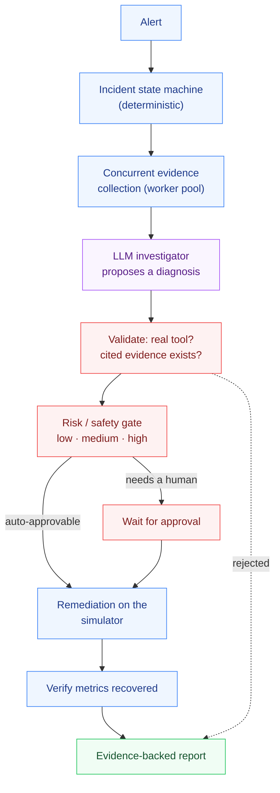

<h1 align="center">AI Incident Commander</h1>

<p align="center"><strong>Go · AI · MCP · deterministic remediation</strong></p>

<p align="center">An autonomous incident-response agent in Go. It ingests an alert, investigates with
structured tools, correlates the evidence into a root cause, and — only through a
deterministic policy gate — proposes or safely executes a remediation, then verifies it
worked and writes an evidence-backed report.</p>

---

## The problem

Multi-agent and LLM-driven automation fails most often not at reasoning but at the seam
between reasoning and action: a model confidently recommends restarting the wrong
service, invents a metric, or is handed the keys to run a production rollback on its own
say-so. The lesson from real incident response is the opposite of "let the model drive":

> **The LLM proposes and reasons. Deterministic code validates and executes.**

This project is built entirely around that rule. Go owns the infrastructure — the state
machine, the concurrency, the tools, the risk policy, the audit trail. The model only
ever produces a *structured hypothesis* that the deterministic layer validates against
reality before anything is allowed to happen. A hallucinated tool name or an unsafe
action never reaches the environment.

## Demo

```
alert ─▶ triage ─▶ investigate (concurrent tools) ─▶ diagnose (model) ─▶ validate
      ─▶ risk gate ─▶ [auto-remediate | wait for human] ─▶ verify ─▶ report
```

```bash
# no API key needed — the default model is a deterministic mock
go run ./cmd/server &

curl -s localhost:8080/incidents -d '{"scenario":"database_overload","auto_approve_medium":true}' | jq '.state, .remediation'
# "RESOLVED"
# { "action": "reduce_db_connections", "service": "database", "safety": "medium", ... }

# a high-risk rollback stops for a human instead of executing:
curl -s localhost:8080/incidents -d '{"scenario":"deployment_regression"}' | jq '.state'
# "WAITING_FOR_APPROVAL"
```

## Architecture



The model sits in exactly one place, and everything it emits passes through validation
and a risk gate before it can touch the world.

## Example

Ask the agent to investigate a cascading failure where the database is the true root but
the alert fires on the API:

```bash
curl -s localhost:8080/incidents -d '{"scenario":"cascading_failure","auto_approve_medium":true}' | jq '.diagnosis'
```

```json
{
  "summary": "database is the most degraded service; its metrics deviate furthest from baseline",
  "hypotheses": [
    { "cause": "database connection pool exhausted (connections at 100)",
      "confidence": 0.93, "evidence_ids": ["e7", "e8", "e9", "e18"] }
  ],
  "recommended_action": "reduce_db_connections",
  "recommended_service": "database",
  "risk": "medium",
  "needs_human_approval": false
}
```

The agent looked past the symptomatic API errors and named the database root — then
fixed the database, and the API recovered on its own.

## Technical decisions

- **Why Go.** The hard parts here are concurrency, worker pools, context cancellation,
  timeouts, and a long-running service — Go's strengths. Evidence from every service is
  collected in parallel and aggregated deterministically before the model is called.
- **Deterministic state machine.** The incident lifecycle (`NEW → … → RESOLVED`, plus
  failure states) is a table of legal transitions. The model never sets state; the
  orchestrator only ever advances it through moves the machine declares legal.
- **The model returns text, the app owns parsing.** `LLMClient.Diagnose` returns raw
  JSON. The agent parses and hard-validates it — unknown tool, unknown evidence ID,
  out-of-range confidence, bad service — and *fails safe to a human* on any violation.
- **A three-level safety model.** Tools declare `low` / `medium` / `high`. LOW runs
  automatically; MEDIUM runs only if auto-approval is enabled; HIGH (e.g. a production
  rollback) **never** runs without an explicit human approval — enforced in the tool
  layer, not just by convention.
- **Provider-agnostic LLM.** The whole system depends only on an interface. A
  deterministic mock reasoner powers every test and the default demo (no API key); an
  OpenAI-compatible client (OpenAI, Azure, Ollama, vLLM) drops in via `LLM_BASE_URL`.
- **Standard library first.** `net/http` with Go 1.22 routing, `log/slog` for structured
  logs, and a tiny Prometheus-text metrics registry — no web framework, no metrics
  dependency.

## Evaluation

Ten deterministic scenarios (database overload, cache collapse, bad deploy, queue
backlog, memory leak, dependency timeout, CPU saturation, network latency, auth failure,
and a database→API cascade) are scored end-to-end by `make evaluate`:

```
AI Incident Commander Evaluation

Scenarios:                 10
Root cause accuracy:       100%
Evidence grounded:         100%
Unsafe actions:            0
Remediation success:       100%
```

Because the mock reasoner is deterministic, these are exact and enforced in CI — the
build fails on any unsafe action or a drop in accuracy. (With a live model the numbers
become a genuine quality signal rather than a fixed value; the harness is identical.)

## Security & guardrails

- **Tool results are untrusted data.** The model can only cite evidence that was actually
  collected; a hypothesis referencing an unknown evidence ID is rejected.
- **No free-form execution.** The model cannot name an action that isn't a real tool, and
  cannot execute anything directly — it recommends, and the deterministic gate decides.
- **HIGH actions are never automatic.** Production-dangerous operations always require a
  human, and the evaluation asserts zero unsafe executions.
- **Bounded loops.** Tool calls are capped; there is no unbounded autonomous loop.
- **Audit trail.** Every state transition and tool call is recorded on the incident.

## Performance

Evidence collection fans across a worker pool with context cancellation, so an
investigation's latency is bounded by the slowest tool, not the sum of all tools. The
whole suite — including the 10-scenario evaluation and a `-race` pass — runs in a couple
of seconds.

## Run it

```bash
make test        # unit + integration + AI tests, all with the mock model
make evaluate    # the deterministic scorecard (exits non-zero on regression)
make run         # start the server on :8080
docker compose up --build
```

## Layout

```
incident-commander/
├── cmd/
│   ├── server/       the HTTP service (graceful shutdown, structured logs)
│   └── evaluate/     the `make evaluate` scorecard gate
├── internal/
│   ├── incident/     the deterministic state machine
│   ├── simulator/    the reproducible environment + 10 scenarios
│   ├── tools/        investigation + remediation tools (safety, authz, audit)
│   ├── policy/       the risk gate (low / medium / high)
│   ├── agent/        orchestration, concurrent collection, output validation
│   │   └── llm/      provider-agnostic client: mock, scripted, OpenAI-compatible
│   ├── api/          net/http REST + read-only MCP endpoint
│   ├── eval/         the scenario scorecard
│   ├── obs/          Prometheus-text metrics
│   └── storage/      in-memory incident store (swappable)
├── pkg/models/       the typed domain contracts
├── prompts/          the model prompts (kept out of code)
├── docs/             architecture, agent design, security, evaluation
└── DESIGN.md         the design argument and the non-goals
```

## Design

See **[DESIGN.md](DESIGN.md)** for the reasoning behind the deterministic/AI split, the
trade-offs taken on purpose, and the explicit non-goals (it's a portfolio-scale system
with a simulated environment, not a production incident platform).

## License

MIT — see [LICENSE](LICENSE).
